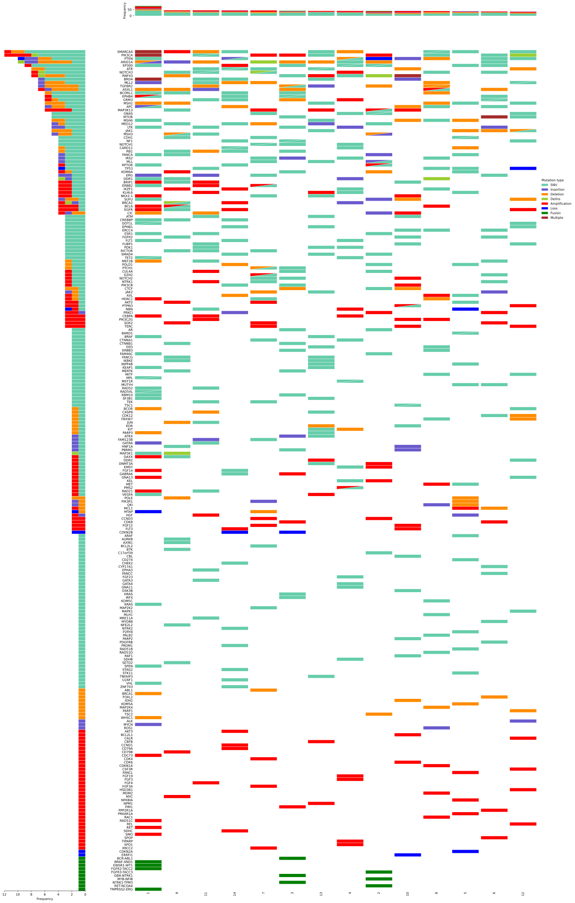
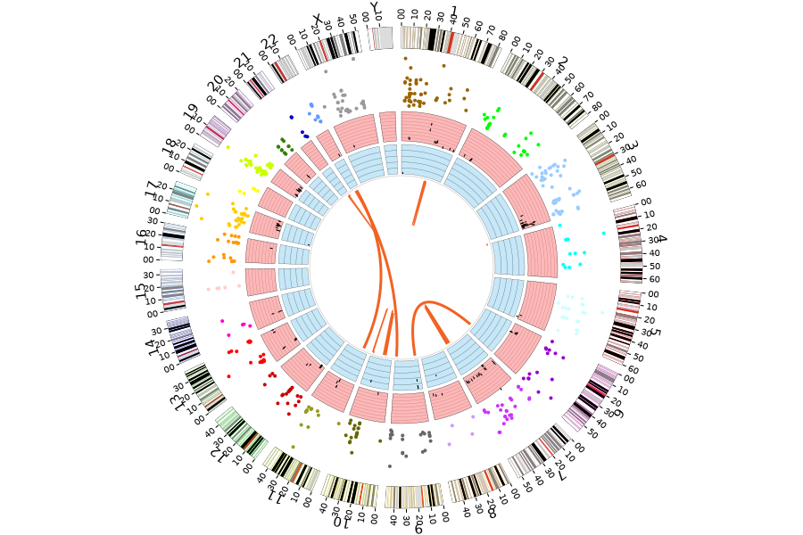
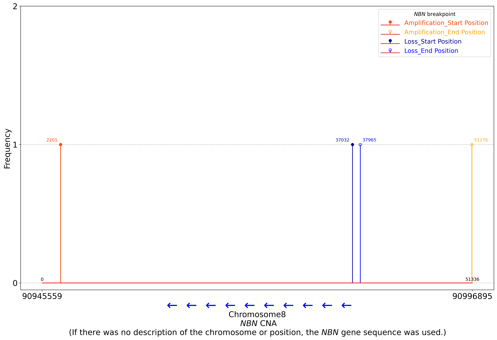
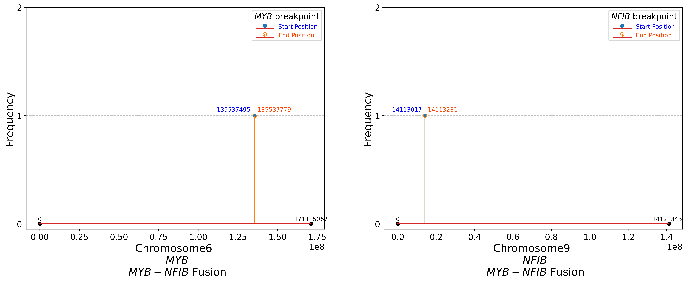

# catstools [beta version]

## 1. Overview
- This is a beta version under testing. Comments are welcome.
- This package provides a toolkit to manipulate files in the CATS (CAncer genomic Test Standardized) format in [ENG](https://www.ncc.go.jp/en/c_cat/section/070/index.html) and [JPN](https://www.ncc.go.jp/jp/c_cat/jitsumushya/060/index.html).
- Please refer to it as CATS|TOOLS and not CAT|STOOLS.
- This program comes with ABSOLUTELY NO WARRANTY.

## 2. Requirements
- Linux
- Python == 3.6 or 3.7  
  Python libraries:
	- comut == 0.0.3
	- jsonschema == 3.2.0
	- matplotlib == 3.5.1
	- numpy == 1.21.6
	- palettable == 3.3.0
	- pandas == 1.3.5
	- pyliftover == 0.4
	- pysam == 0.15.3
- GRCh38/37 (Genome Reference Consortium Human 38/37)

## 3. Install
Tools and data are subject to the rights set forth by their respective owners.  

### 3.1 Python package installation
```
pip3 install .
```

### 3.2 Download the reference genome sequence (GRCh38)
```
curl -LR https://api.gdc.cancer.gov/data/254f697d-310d-4d7d-a27b-27fbf767a834 | tar xzvf -
```

### 3.3 Download the reference genome sequence (GRCh37)
```
curl -L -O ftp://ftp.ensembl.org/pub/grch37/current/fasta/homo_sapiens/dna/Homo_sapiens.GRCh37.dna.primary_assembly.fa.gz
gunzip Homo_sapiens.GRCh37.dna.primary_assembly.fa.gz
```

### 3.4 Download cytoband
```
curl -L -O https://hgdownload.cse.ucsc.edu/goldenpath/hg38/database/cytoBand.txt.gz
gunzip cytoBand.txt.gz
mv -i cytoBand.txt /path/to/catstools/reference
```

### 3.5 Download hg19ToHg38.over.chain
```
curl -L -O https://hgdownload.cse.ucsc.edu/goldenpath/hg19/liftOver/hg19ToHg38.over.chain.gz
gunzip hg19ToHg38.over.chain.gz
mv -i hg19ToHg38.over.chain /path/to/catstools/reference
```

### 3.6 Download NGCircos
```
wget --no-check-certificate https://github.com/YaCui/NG-Circos/archive/master.tar.gz
tar zxf master.tar.gz
mv -i NG-Circos-master/genome/karyotype.human.grch38* /path/to/catstools/aggregation/circos_plot/js/genome_data
mv -i NG-Circos-master/genome/karyotype.human.hg19.js /path/to/catstools/aggregation/circos_plot/js/genome_data
mv -i NG-Circos-master/genome/karyotype.human.hg19_genome.js /path/to/catstools/aggregation/circos_plot/js/genome_data
mv -i NG-Circos-master/*.js /path/to/catstools/aggregation/circos_plot/js/lib
mv -i NG-Circos-master/python_script/NGCircos_PrepareData.py /path/to/catstools/aggregation/circos_plot
```

## 4. Usage

### 4.1 Format Update
Update the schema version of the CATS format to a specified version. If not specified, update to the latest version.  
This update is designed for differences between versions, for example, adding tags and options. [\[Sample data\]](./samples/format_update/)
```
$ catstools format_update -h
Usage: catstools format_update [-h] --input INPUT --output OUTPUT
                               [--to-version TO_VERSION]

Optional arguments:
  -h, --help            Show this help message and exit
  --input INPUT         Input cats format json file
  --output OUTPUT       Output cats format json file
  --to-version TO_VERSION
                        Updated cats format version
                        [1.0, 1.0.1, 1.1.0, 1.2.0]
```

### 4.2 Validation
Validate the CATS format. [\[Sample data\]](./samples/validation/)  
If no problems are provided during the validation process, there will be no output.  
```
$ catstools validation -h
Usage: catstools validation [-h] --input INPUT --fasta-grch38 FASTA_GRCH38
                            --fasta-grch37 FASTA_GRCH37

Optional arguments:
  -h, --help            Show this help message and exit
  --input INPUT         Input cats format json file
  --fasta-grch38 FASTA_GRCH38
                        GRCh38 reference fasta file
  --fasta-grch37 FASTA_GRCH37
                        GRCh37 (hg19) reference fasta file
```

### 4.3 File Conversion

#### 4.3.1 Conversion to formats supported by cBioPortal

##### 4.3.1.1 CATS format to cBioPortal formats
Convert the CATS format into a set of files that can be imported into cBioPortal. [\[Sample data\]](./samples/cats2cBioPortal/)  
For example:  
- The "shortVariants" tag is converted to data_snv.vcf for variant call and meta_mutations_extended.txt for metadata in cBioPortal.  
- For other conversions, see [\[Sample data\]](./samples/cats2cBioPortal/).  
```
$ catstools cats2cBioPortal -h
Usage: catstools cats2cBioPortal [-h] --input INPUT 
                                 --output-dir OUTPUT_DIR

Optional arguments:
  -h, --help            Show this help message and exit
  --input INPUT         Input cats format json file
  --output-dir OUTPUT_DIR
                        Output directory path
```
[Note]  
&emsp;&ensp;To import the short variant data into cBioPortal, the output vcf file needs to be further converted to the maf format of cBioPortal.  
&emsp;&ensp;See below for guidelines:  
&emsp;&ensp;[Convert vcf to maf (GitHub: mskcc/vcf2maf)](https://github.com/mskcc/vcf2maf)

##### 4.3.1.2 cBioPortal formats to CATS format
Convert a set of cBioPortal formats to the CATS format. [\[Sample data\]](./samples/cBioPortal2cats/)  
```
$ catstools cBioPortal2cats -h
Usage: catstools cBioPortal2cats [-h] --input-dir INPUT_DIR 
                                 --output OUTPUT 
                                 [--grc-release GRC_RELEASE] 
                                 --test-type TEST_TYPE 
                                 [--panel-name PANEL_NAME]
                                 [--panel-version PANEL_VERSION]

Optional arguments:
  -h, --help            Show this help message and exit
  --input-dir INPUT_DIR Input directory path
  --output OUTPUT       Output cats format json file
  --grc-release GRC_RELEASE
                        "GRCh37" or "GRCh38"
  --test-type TEST_TYPE "tumor-only" or "tumor and matched-normal", "tumor-only (cell-free)",
                        "tumor (cell-free) and matched-normal"
  --panel-name PANEL_NAME
                        Name of your genomic profiling (gene panel) test
  --panel-version PANEL_VERSION
                        Version of your test
```
[Note]  
&emsp;&ensp;For details on GRC_RELEASE, TEST_TYPE, PANEL_NAME, and PANEL_VERSION, see the CATS format documents in [ENG](https://www.ncc.go.jp/en/c_cat/section/070/index.html) and [JPN](https://www.ncc.go.jp/jp/c_cat/jitsumushya/060/index.html).

#### 4.3.2 [Additional] Conversion to other formats, such as vcf and bed formats, internally used in C-CAT
Convert the CATS format into a set of formats internally used in C-CAT.  
&emsp; * Data in the CATS format are automatically converted into data based on GRCh38 in the other formats.

##### 4.3.2.1 Short variants
Convert the "shortVariants" tag to the vcf format. [\[Sample data\]](./samples/c-cat/short_variants/)  
&emsp; * The header and INFO column in this vcf are different from those in the vcf for cBioPortal.
```
$ catstools short_variants -h
Usage: catstools short_variants [-h] --input INPUT (--somatic | --germline)
                                --output-variant OUTPUT_VARIANT 
                                --output-map OUTPUT_MAP 
                                --fasta-grch38 FASTA_GRCH38

Optional arguments:
  -h, --help            Show this help message and exit
  --input INPUT         Input cats format json file
  --somatic             Extract somatic SNVs
  --germline            Extract germline SNVs
  --fasta-grch38 FASTA_GRCH38
                        GRCh38 reference fasta file
  --output-variant OUTPUT_VARIANT
                        Output vcf file
  --output-map OUTPUT_MAP
                        Output reference map file
```
[Note]  
&emsp;&ensp;The reference map file is internally used in C-CAT to associate itemIds in the CATS format with alterations in the other converted formats.  
&emsp;&ensp;For example:  
```
  {
    "DNA_somatic_2_32508081_C_T": "itemId-1",
    "DNA_somatic_3_169095246_C_T": "itemId-2"
  }
```

##### 4.3.2.2 Copy number alterations
Convert the "copyNumberAlterations" tag to bed format. [\[Sample data\]](./samples/c-cat/copy_number_alterations/)  
```
$ catstools copy_number_alterations -h
Usage: catstools copy_number_alterations [-h] --input INPUT 
                                         --output-variant OUTPUT_VARIANT 
                                         --output-map OUTPUT_MAP

Optional arguments:
  -h, --help            Show this help message and exit
  --input INPUT         Input cats format json file
  --output-variant OUTPUT_VARIANT
                        Output cna bed file
  --output-map OUTPUT_MAP
                        Output reference map file
```
[Note]  
&emsp;&ensp;For the reference map file, see [4.3.2.1 Short variants](#4321-short-variants) [Note] description.  

##### 4.3.2.3 Rearrangements
Convert the "rearrangements" tag to the bedpe and json formats. [\[Sample data\]](./samples/c-cat/rearrangements/)  
- The bedpe format is used for fusions.  
- The json format is used for other rearrangements.  
```
$ catstools rearrangements -h
Usage: catstools rearrangements [-h] --input INPUT
                                (--fusion | --except-fusion) (--dna | --rna)
                                --output-variant OUTPUT_VARIANT 
                                --output-map OUTPUT_MAP

Optional arguments:
  -h, --help            Show this help message and exit
  --input INPUT         Input cats format json file
  --fusion              Extract fusion
  --except-fusion       Extract except fusion
  --dna                 Extract DNA
  --rna                 Extract RNA
  --output-variant OUTPUT_VARIANT
                        Output rearrangement bedpe file
  --output-map OUTPUT_MAP
                        Output reference map file
```
[Note]  
&emsp;&ensp;For the reference map file, see [4.3.2.1 Short variants](#4321-short-variants) [Note] description.  

##### 4.3.2.4 Gene expressions
Convert the "expressions" tag to the json format. [\[Sample data\]](./samples/c-cat/expressions/)  
```
$ catstools expressions -h
Usage: catstools expressions [-h] --input INPUT 
                             --output-variant OUTPUT_VARIANT

Optional arguments:
  -h, --help            Show this help message and exit
  --input INPUT         Input cats format json file
  --output-variant OUTPUT_VARIANT
                        Output expression json file
```

##### 4.3.2.5 Other biomarkers
Convert the "otherBiomarkers" tag to the json format. [\[Sample data\]](./samples/c-cat/other_biomarkers/)  
```
$ catstools other_biomarkers -h
Usage: catstools other_biomarkers [-h] --input INPUT 
                                  --output-variant OUTPUT_VARIANT

Optional arguments:
  -h, --help            Show this help message and exit
  --input INPUT         Input cats format json file
  --output-variant OUTPUT_VARIANT
                        Output other biomarker json file
```

### 4.4 Aggregation
Draw a graph based on the CATS format. [\[Sample data\]](./samples/aggregation/)  
```
$ catstools aggregation -h
Usage: catstools aggregation [-h] --mode MODE
                             --input-pattern INPUT_PATTERN
                             --output-dir OUTPUT_DIR

Optional arguments:
  -h, --help            Show this help message and exit
  --mode MODE           Graph aggregation mode
                        1: onco_plot
                        2: circos_plot
                        3: gene_analysis_plot_amino_acids
                        4: gene_analysis_plot_dna_except_fusion
                        5: gene_analysis_plot_cna
                        6: gene_analysis_plot_fusion
  --input-pattern INPUT_PATTERN
                        Glob pattern to catch input files
  --output-dir OUTPUT_DIR
                        Output directory path
```
  
[Note]  
- Files with the extension ".cats" among files captured using a glob pattern are considered for aggregation. Those files with the extension must be in the CATS format and undergo the update and validation explained in [4.1 Format Update](#41-format-update) and [4.2 Validation](#42-validation), respectively.  
- INPUT_PATTERN argument must be specified in double quotation marks.  
  
&emsp;&ensp;For example:  
```
  catstools aggregation --mode 1
                        --input-pattern "/path/to/input_file/**/*.cats"
                        --output-dir /path/to/output_directory
```
  
Samples for each mode  
1: onco_plot  
<kbd><a href="samples/aggregation/output/1onco_plot/oncogene_x2.svg"></a></kbd>  
  
2: circos_plot  
<kbd><a href="samples/aggregation/output/2circos_plot/NGCircos_readme.svg"></a></kbd>  
&emsp;&ensp;[Note]  
&emsp;&ensp;&emsp;&ensp;The image below shows the js file output by the command, displayed in html.  
  
3: gene_analysis_plot_amino_acids  
<kbd><a href="samples/aggregation/output/3gene_analysis_plot_amino_acids/aminoplot_ARID1A.png"></a></kbd>  
  
4: gene_analysis_plot_dna_except_fusion  
<kbd><a href="samples/aggregation/output/4gene_analysis_plot_dna_except_fusion/geneplot_VEGFA.png"></a></kbd>  
  
5: gene_analysis_plot_cna  
<kbd><a href="samples/aggregation/output/5gene_analysis_plot_cna/cna_geneplot_NBN.png"></a></kbd>  
  
6: gene_analysis_plot_fusion  
<kbd><a href="samples/aggregation/output/6gene_analysis_plot_fusion/Fusion_geneplot_MYB-NFIB.png"></a></kbd>  
  
